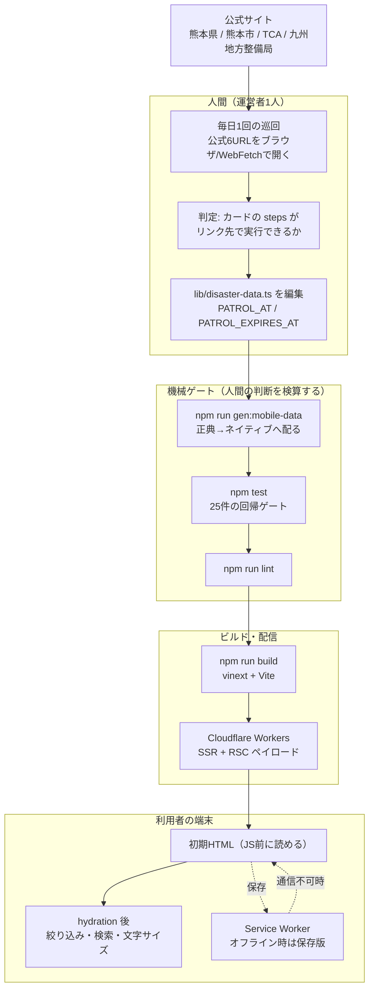
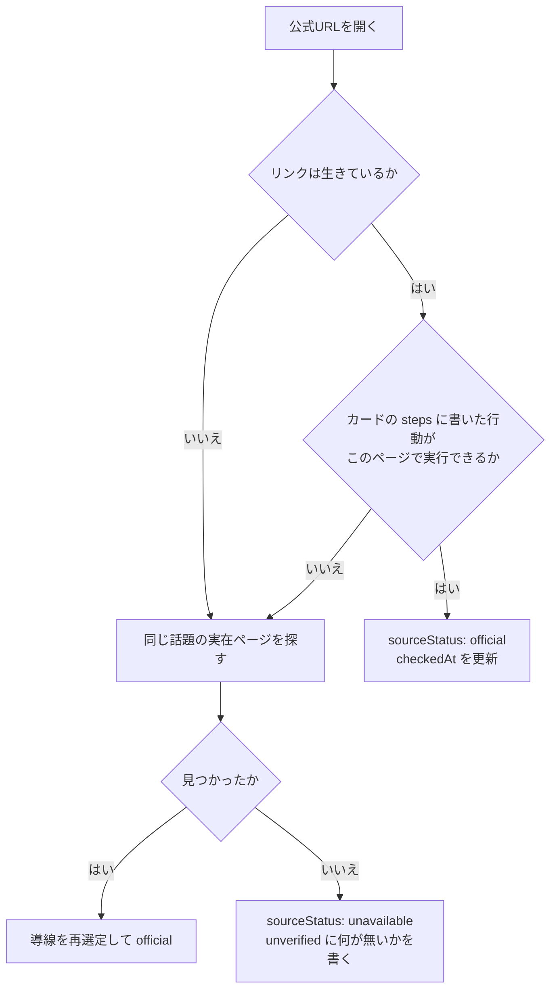
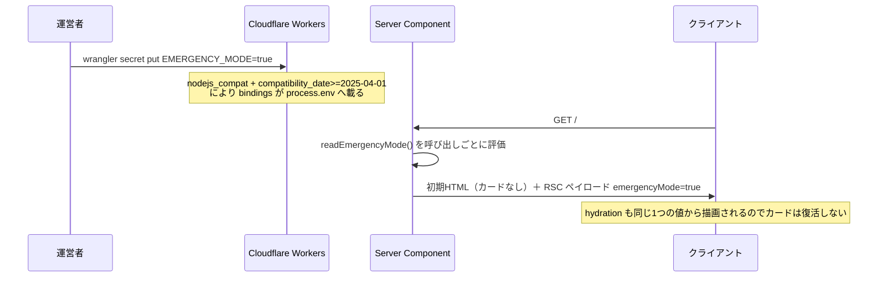
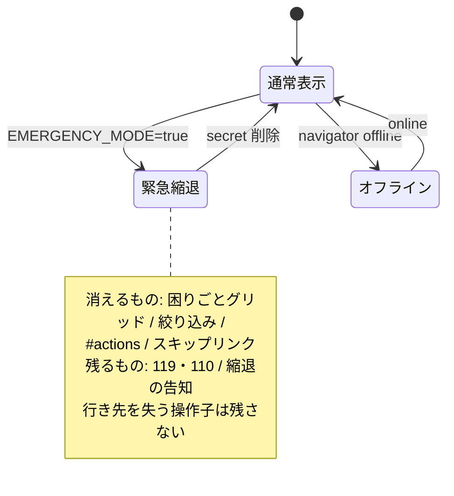
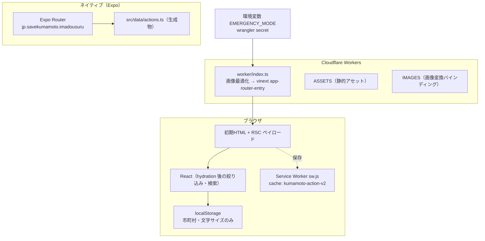
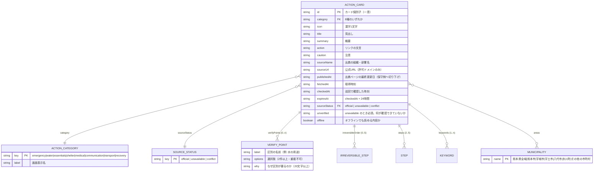

# 設計書 — くまもと いまどうするナビ

2026-07-31 時点の実装から起こした設計書。**動いているコードに書かれていることだけを載せる**。
まだ無いもの・確認できていないものは「無い」「未確認」と書き、あるかのように書かない。

| 章 | 内容 |
|---|---|
| [1. コンセプト](#1-コンセプト) | 何のためのアプリで、何をしないか |
| [2. 情報処理の流れ](#2-情報処理の流れ) | 情報が公式サイトから利用者の画面に届くまで |
| [3. 画面設計書](#3-画面設計書) | 画面の構成・状態・操作子 |
| [4. システム構成](#4-システム構成) | 実行環境と配置 |
| [5. API定義書](#5-api定義書) | 公開している経路と、持っていない API |
| [6. ER図](#6-er図) | データ構造（DB は無い） |

関連: `README.md` / `docs/OPERATIONS.md`（運用手順）/ `docs/RELEASE_AUDIT.md`（公開判定）

---

## 1. コンセプト

### 一文

被災者が「いま何に困っているか」から、公式情報へ最短で到達するための**読み取り専用**の道案内。

### 解こうとしている問題

災害時に情報が無いのではなく、**どれが今も有効か分からない**ことが問題になる。
検索で出てくるページは前回の災害のものかもしれず、SNS の「配ってました」は3時間前かもしれない。
利用者は情報の鮮度を確かめる手段を持たないまま、水を汲みに行き、店に向かい、申請の期限を逃す。

### このアプリが引き受ける範囲

```text
引き受ける : 困りごと → 該当する公式ページ → そこで何を確認すべきか
引き受けない: 現在の稼働状況の判定（給水車が今いるか、店が開いているか、道が通れるか）
```

現在の稼働状況は、自治体・現場からの更新経路が無ければ原理的に出せない。
**無い情報を「たぶん大丈夫」で埋めない**ことを、機能の多さより優先する。

### 唯一守ると約束した品質基準

**鮮度と失効を正直に出す。** これを崩す変更は、他のどんな利点があっても入れない。

具体的には次の3つを守る。

1. **期限切れは期限切れと出す。** 全カードに `expiresAt` があり、過ぎたカードは
   「現在の状況は確認できません」に切り替わる。基本手順は残すが、場所・時間は出さない
2. **公式ページを再確認せずに期限を延ばさない。** これは鮮度の捏造にあたる（`docs/OPERATIONS.md` 第5章）
3. **確認できていないことを、確認できたように見せない。** リンクは生きているのに
   そのページに話題の記載が無いときは `sourceStatus: "unavailable"` とし、
   何が確認できていないのかを画面に本文として出す

### しないこと（設計上の制約）

ログイン / GPS / 住所 / 氏名 / 被害写真 / 健康情報 / 利用者投稿 / 広告 / アクセス解析を
**一切扱わない**。収集しないのではなく、**収集する経路をコードに持たない**。

そのため、このアプリには利用者を識別する手段が無く、サーバーに保存される利用者データも無い。

### 誤認を防ぐための表示

被災者が最も損をするのは、情報が無いことより**取り違え**である。実装済みのものは2種類。

| 表示 | 目的 | 例 |
|---|---|---|
| `verifyPoints` | 混同すると健康被害・無駄足になる区別を、選択肢と理由で強制表示する | 給水の「飲料用 / 生活用水」（水質検査10項目が根拠） |
| `irreversibleOrder` | 順序を誤ると取り返しがつかない手続きを出す | 「片付けや修理の前に写真を撮る」「支払い・契約の前に相談する」 |

いずれも**出典ページに実際に書かれている記載だけ**を根拠にする。区分を推測で作らない。

---

## 2. 情報処理の流れ

### 全体



### 重要な性質

**公式サイトから自動で取得していない。** 実行時に外部へ取りに行く処理はコードに無い。
情報は人間が確認し、`lib/disaster-data.ts` に手で書く。だから鮮度は人間の巡回頻度が上限になり、
その上限を隠さないために `checkedAt` / `expiresAt` を全カードに持たせている。

**正典は1つ。** `lib/disaster-data.ts` だけが情報の原本で、ネイティブ用
`apps/mobile/src/data/actions.ts` は `npm run gen:mobile-data` の生成物。
手で二重管理すると、片方だけ古い案内を出す。`tests/mobile-parity.test.mjs` が
生成し忘れを機械で止める。

### 巡回の判定ルール（2026-07-31 に更新）



**「リンク生存＋内容不変」だけを見る確認では足りない。**
2026-07-31 の巡回で、6カードが「リンクは生きているが、そのページに話題の記載が無い」
状態だと判明した。給水カードの手順「公式ページで開設中の給水所と実施時間を確認する」に従っても、
リンク先の県 防災推進課ページに給水情報は無かった。この壊れ方は URL の生存確認では検出できない。

### 失効の判定

```text
isExpired(card, now) := now.getTime() >= new Date(card.expiresAt).getTime()
expiresAt            := checkedAt + 24時間
```

境界時刻ちょうどで**失効側**へ倒す（`tests/data-contract.test.mjs` が境界を固定）。
`now` は60秒ごとに更新されるので、画面を開いたまま期限を跨いでも表示が切り替わる。

### 緊急停止の流れ

誤った案内を出したときに、再ビルド・再デプロイなしで個別カードを止める経路。



**守ること**（`lib/emergency-mode.ts` に記載、`tests/emergency-mode.test.mjs` が固定）:

- 変数名に `NEXT_PUBLIC_` を付けない（ビルド時に全環境へ define され、以後止まらなくなる）
- クライアントコンポーネントから読まない（クライアントバンドルでは `process.env` が `{}`）
- モジュールのトップレベルで値を確定させない（Node 常駐で一度しか評価されない）

**停止が届かない範囲**（設計上の既知の穴）: 開いたままのタブ / オフラインの PWA /
ネイティブアプリ。ネイティブへの停止経路（EAS Update / OTA）は未実装で、
ストア申請の必須前提条件として `docs/OPERATIONS.md` に記録している。

---

## 3. 画面設計書

### 画面一覧

| # | 経路 | 種別 | 目的 |
|---|---|---|---|
| W-1 | `/` | Client Component（props で停止フラグ受領） | 困りごとから公式情報へ |
| W-2 | `/status` | Server Component | 運用状態と安全境界の開示 |
| N-1 | `index` | Expo Router | W-1 のネイティブ版 |
| N-2 | `offline-guides` | Expo Router | 通信不可でも読める一般手順 |
| N-3 | `about` | Expo Router | 安全と出典について |

### W-1 `/` 案内画面

```text
┌─────────────────────────────────────────┐
│ 緊急ストリップ    119 ▸   110 ▸         │  ← 常に最上部。停止中も残す
├─────────────────────────────────────────┤
│ ヘッダー          文字の大きさ 標準 大 特大│  ← 48x48dp
├─────────────────────────────────────────┤
│ ヒーロー「いま、一番…」                  │
│ 最終確認 <time> / 鮮度の注記             │
├─────────────────────────────────────────┤
│ 困りごとグリッド（4列 × 8種）            │  ← 報/水/食/避/薬/電/道/片＋件数
├─────────────────────────────────────────┤
│ 絞り込み   [市町村 ▾]  [キーワード検索]   │
├─────────────────────────────────────────┤
│ #actions  「○○で確認すること」 N件       │
│   カテゴリナビ（横スクロール）            │
│   ┌───────────────────────────────────┐ │
│   │ アクションカード × N               │ │
│   └───────────────────────────────────┘ │
├─────────────────────────────────────────┤
│ このアプリがしないこと                    │
│ フッター（運用ステータスへの導線）        │
└─────────────────────────────────────────┘
```

#### アクションカードの構成（上から順）

| 要素 | 出す条件 | 意図 |
|---|---|---|
| アイコン（漢字1文字） | 常時 | 画像を持たずに識別する。119/110 の隣にマスコットを置かない |
| メタ（カテゴリ / オフライン保存 / **公式情報** または **未確認** / 期限切れ） | 常時 | `unavailable` に「公式情報」と付けない |
| 見出し | 常時 | |
| 概要 **または** 期限切れメッセージ | 排他 | 期限切れ時は場所・時間を出さない |
| **公式の案内を確認できていません** | `sourceStatus === "unavailable"` | 手順より**前**に出す。「行けば分かる」と誤解させない |
| まずやること（番号付き手順） | 常時 | 2〜5件・各60文字以内・断定表現禁止（機械ゲート） |
| **公式ページで必ず確認する: ラベル** | `verifyPoints` あり | **期限切れでも隠さない**。区別の必要性は期限と無関係 |
| **順番を間違えると取り返しがつきません** | `irreversibleOrder` あり | 同上 |
| 注意 | 常時 | 個人情報の投稿抑止を含む |
| 有効期限 / 接続確認からの経過 | 常時 | |
| 出典と時刻の詳細（折りたたみ） | 常時 | 出典・案内更新・取得・接続確認・有効期限 |
| 公式サイトを開くリンク | 常時 | オフライン時は無効化し「オフラインのため開けません」 |

#### 状態と遷移



**縮退中に無反応の操作子を残さない。** 困りごとグリッド・市町村/検索・スキップリンクは
行き先の `#actions` ごと消えるため、押しても何も起きないボタンになる。だから条件付きで描画ごと外す。

#### クライアント状態

| state | 初期値 | 永続化 | 備考 |
|---|---|---|---|
| `municipality` | `熊本県全域` | `localStorage: relief-area` | |
| `category` | `all` | なし | |
| `query` | 空 | なし | |
| `textScale` | `standard` | `localStorage: relief-text-scale` | 旧 `relief-large-text` から移行 |
| `offline` | `false` | なし | `online`/`offline` イベント |
| `now` | 現在時刻 | なし | 60秒ごとに更新（失効表示の切り替え） |

`localStorage` の読み出しは `useEffect` 内の `queueMicrotask` で行い、
サーバーとクライアントの初期描画を一致させる（hydration 不一致を避ける）。

#### 検索の並び順

一致したカードを次の順で並べる。`useMemo` 内で実装。

```text
0: 見出しに一致
1: keywords に一致
2: それ以外（本文一致）
同順位は元の並び順を保つ
```

「薬」で高齢者カードが先に出たり、「ペット」が本文の「ペットボトル」に反応して
給水カードが避難所より上に来たりするのを防ぐ。

#### アクセシビリティ

- 押せる要素は**すべて 48x48dp 以上**（390 / 360 / 320px で実測、`scripts/qa/tap-target-check.mjs`）
- 文字サイズ 標準 / 大 / 特大 を利用者が選べる
- `aria-pressed` / `aria-live="polite"` / `aria-label`（外部リンクであることを読み上げる）
- スキップリンクで `#actions` へ直行

### W-2 `/status` 運用ステータス

Server Component。リクエストごとに `readEmergencyMode()` を読む。
**secret は読み出せないため、現在の停止状態を確認できる唯一の経路**。

```text
運用ステータス
くまもと いまどうするナビ
┌──────────────────────────────┐
│ 通常表示 / 緊急縮退中          │  ← 状態によって配色を変える
└──────────────────────────────┘
安全上の状態
  ・利用者投稿・支援要請・寄付・決済：提供していません
  ・GPS・住所・氏名・健康情報：収集していません
  ・期限切れ情報：現在不明として表示します
  ・公式サイト障害：保存時刻を示し、最新とは表示しません
→ 案内画面へ戻る
```

**`[提案]` 未実装**: 「誤りを見つけたら」の窓口を出す。実値は `[要記入]`
（remote 未設定のため GitHub Issues が存在しない）。トップページには出さない
（119・110 の導線と competing させない）。

### ネイティブ（N-1〜N-3）

Expo Router の Stack。`index` はヘッダー非表示、他2画面はタイトル表示。
`index` は W-1 と同じ絞り込み・検索・文字サイズ・失効判定を持ち、データは生成物を読む。

**既知のパリティ差分**: `verifyPoints` / `irreversibleOrder` / `unverified` は
生成物としてネイティブへ配られているが、**N-1 の画面にはまだ描画していない**。
Web だけが誤認防止の表示を持っている状態。

---

## 4. システム構成

### 配置



### 技術構成

| 層 | 採用 | バージョン |
|---|---|---|
| フレームワーク | vinext（Vite + React Server Components / App Router） | 0.0.50 |
| React | React / React DOM | 19.2.8 |
| ビルド | Vite | 8.1.5 |
| 実行環境 | Cloudflare Workers（`@cloudflare/vite-plugin`） | 1.48.0 |
| デプロイCLI | wrangler | 4.115.0 |
| 型 | TypeScript（`tsc --noEmit` を lint として使う） | 5.9.3 |
| CSS | 手書き `app/globals.css`（カスタムプロパティでライト/ダーク切替） | — |
| ネイティブ | Expo / Expo Router / React Native | `expo ^57.0.0` / `expo-router ~57.0.9` / `react-native 0.86.2` |
| テスト | `node --test`（追加の依存なし） | — |

### Workers の必須設定

```jsonc
{
  "main": "./worker/index.ts",
  // bindings が process.env へ載る条件。ここを割ると停止スイッチが黙って効かなくなる。
  "compatibility_date": "2026-07-28",
  "compatibility_flags": ["nodejs_compat"]
}
```

`compatibility_date >= 2025-04-01` かつ `nodejs_compat` のときだけ、Workers は
bindings を `process.env` へ流し込む。プラグイン既定値に任せると、更新でこの日付を
割った瞬間に `lib/emergency-mode.ts` が環境変数を読めなくなる。
`tests/emergency-mode.test.mjs` がこの前提条件を固定している。

### 持っていないインフラ

```text
KV / D1 / R2 / Durable Objects / キュー / cron trigger : なし
データベース                                          : なし
認証基盤・セッション                                   : なし
外部APIクライアント                                    : なし
アクセス解析・広告・エラー収集SaaS                      : なし
```

`.openai/hosting.json` は `{"d1": null, "r2": null}` で、`vite.config.ts` の
D1 / R2 バインディングは条件分岐ごと無効。`db/` と `drizzle/` は空ディレクトリで、
参照しているコードは存在しない（`grep` で確認済み）。

**infra を足さない**のは意図的な設計判断。状態を持たない限り、
漏れる利用者データも、壊れる整合性も、復旧すべきバックアップも発生しない。

### オフライン

Service Worker（`public/sw.js`、キャッシュ名 `kumamoto-action-v2`）。

| リクエスト | 戦略 |
|---|---|
| ナビゲーション（HTML） | network-first。成功時は `/` として保存、失敗時は保存版を返す |
| 同一オリジンの GET | cache-first。未保存なら取得して保存 |
| 他オリジン / GET 以外 | 介入しない |

プリキャッシュ対象は `/` `/manifest.webmanifest` `/favicon.svg`。

**オフラインでの制約**: 保存版の HTML は停止スイッチの反映前かもしれない。
これは「停止が届かない範囲」として `docs/OPERATIONS.md` に記録済み。

### 検証コマンド

```bash
npm run lint             # tsc --noEmit
npm test                 # build + node --test（25件）
npm run gen:mobile-data  # 正典→ネイティブ生成（差分ゼロが正常）
npm run build && npm run start -- --port 3123
node scripts/qa/hydration-check.mjs 9333 http://localhost:3123/    # 停止が hydration 後も効くか
node scripts/qa/tap-target-check.mjs 9333 http://localhost:3123/ 360  # タップ領域
```

---

## 5. API定義書

### このアプリは API を持たない

**外部へ公開する REST / GraphQL / RPC エンドポイントは存在しない。**
`POST` / `PUT` / `DELETE` を受ける経路も、JSON を返す経路も実装していない。
利用者から送られてくるデータが無いので、受け口を持つ必要がない。

以下は「公開している HTTP 経路」の一覧であって、API 定義ではない。

### 公開経路

| メソッド | パス | 応答 | 認証 | 備考 |
|---|---|---|---|---|
| GET | `/` | `text/html`（SSR + RSC ペイロード） | なし | 案内画面 |
| GET | `/status` | `text/html` | なし | 運用ステータス |
| GET | `/manifest.webmanifest` | `application/manifest+json` | なし | PWA マニフェスト（`lang: ja`） |
| GET | `/sw.js` | `application/javascript` | なし | Service Worker |
| GET | `/favicon.svg` | `image/svg+xml` | なし | |
| GET | `/_vinext/image` | 変換後の画像 | なし | `worker/index.ts` が処理。許可幅は vinext の既定値のみ |
| GET | その他 | 静的アセット or 404 | なし | `ASSETS` バインディング |

**すべて認証なし・すべて GET・すべて公開情報。** クエリパラメータで利用者を識別しない。
Cookie を発行しない。

### 応答ヘッダ

`Cache-Control` を明示設定していない［中］。エッジ・中間プロキシで HTML が
実際にキャッシュされるかは未確認。必要になれば `worker/index.ts` で HTML に
`no-cache` を付ける（`no-store` は bfcache を殺すので使わない）。

### 外部への発信

**実行時に外部へ出ていく通信は無い。** 公式サイトへのリンクは `<a href target="_blank">` で、
利用者のブラウザが直接開く。アプリのサーバーが公式サイトを取りに行くことはない。

情報の取得は、運営者が巡回時に手で行う（`docs/OPERATIONS.md` 第5章）。

### 内部の契約（API ではないが、破ると壊れるもの）

#### 正典 → ネイティブ生成

```text
入力 : lib/disaster-data.ts
出力 : apps/mobile/src/data/actions.ts
実行 : npm run gen:mobile-data
```

`scripts/generate-mobile-data.mjs` はソーステキストを2箇所で切る。

| マーカー | 用途 |
|---|---|
| `export const municipalities` | ここまでを「型定義ブロック」として複製 |
| `export const siteCheckedAt` | ここから末尾を「時刻ヘルパー」として複製 |

**このマーカー文字列を消したり並びを変えたりすると生成が落ちる**（`throw` する）。
カード本体は `JSON.stringify(actionCards)` で埋め込むので、`ActionCard` に
フィールドを足せば自動的にネイティブへ配られる。

`tests/mobile-parity.test.mjs` が「生成物が正典と一致すること」と
「再生成し忘れていないこと」を機械で止める。

#### 環境変数

| 名前 | 型 | 既定 | 意味 |
|---|---|---|---|
| `EMERGENCY_MODE` | `"true"` のみ真 | 未設定 | 緊急縮退モード。`"true"` 以外はすべて偽 |

`NEXT_PUBLIC_` を**絶対に付けない**（理由は第2章）。設定は
`npx wrangler secret put EMERGENCY_MODE`、ローカルは `.dev.vars` または
`EMERGENCY_MODE=true npm run start`。

---

## 6. ER図

### データベースは無い

永続化層を持たないので、**テーブルもリレーションも外部キーも存在しない**。
以下は TypeScript の型として定義されたデータ構造の関係図であり、DB スキーマではない。

実体は `lib/disaster-data.ts` に**ソースコードとして直接書かれた配列**で、
ビルド時にバンドルへ埋め込まれる。実行時に読み書きする永続ストアは無い。

### 構造



`conflict`（出典間で記載が食い違う状態）は型に定義済みだが、**現在使っているカードは無い**。

### 制約（テストで機械的に守っているもの）

| 対象 | 制約 | 検査 |
|---|---|---|
| `sourceUrl` | `pref.kumamoto.jp` / `city.kumamoto.jp` / `tca.or.jp` / `qsr.mlit.go.jp` のみ | `data-contract` |
| 時刻4種 | すべて解釈可能 / `publishedAt <= fetchedAt` / `checkedAt <= expiresAt` | `data-contract` |
| `sourceStatus` | `official` または `unavailable` | `data-contract` |
| `unverified` | `unavailable` なら20文字以上かつ「確認できません（でした）」を含む。`official` なら未定義 | `data-contract` |
| `steps` | 2〜5件 / 各5〜60文字 / 断定表現（「必ず開」「在庫あり」「営業中です」等）を含まない | `data-contract` |
| `verifyPoints` | `options` 2件以上・重複なし / `why` 20文字以上 | `data-contract` |
| `water` カード | 飲料と生活用水を並べる `verifyPoints` を必ず持つ | `data-contract` |
| `irreversibleOrder` | 2〜5件 / 各5〜60文字 | `data-contract` |
| 検索到達性 | 「こども」「くすり」「みず」等18語から意図したカードへ届く | `data-contract` |
| カテゴリ網羅 | R1必須8カテゴリをすべて備える | `data-contract` |
| 失効境界 | `expiresAt` ちょうどで失効側へ倒れる | `data-contract` |
| 正典↔生成物 | 全カードが `deepEqual` / 再生成し忘れが無い | `mobile-parity` |

### 端末に保存されるもの

サーバー側に利用者データは無い。端末側は次の2つだけ。

| 保存先 | キー | 内容 | 個人を識別するか |
|---|---|---|---|
| `localStorage` | `relief-area` | 選んだ市町村名 | しない |
| `localStorage` | `relief-text-scale` | 文字サイズ（`standard`/`large`/`xlarge`） | しない |
| Cache Storage | `kumamoto-action-v2` | HTML と静的アセット | しない |

`relief-large-text`（旧キー）は読み取り時に `relief-text-scale` へ移行する。

---

## 未確認のまま残っていること

推測で埋めない。

- **本番 Cloudflare Workers での反映実時間**。デプロイ承認後にしか測れない
- **停止中デプロイで停止が維持されるか**。`wrangler deploy` が vars を全消しし secrets は残す、
  というコードからの推論［高］だが本番未実施
- **`Cache-Control` 未設定の HTML がエッジで実際にキャッシュされるか**［中］
- **ネイティブ画面での誤認防止表示**。データは配られているが未描画（第3章のパリティ差分）
