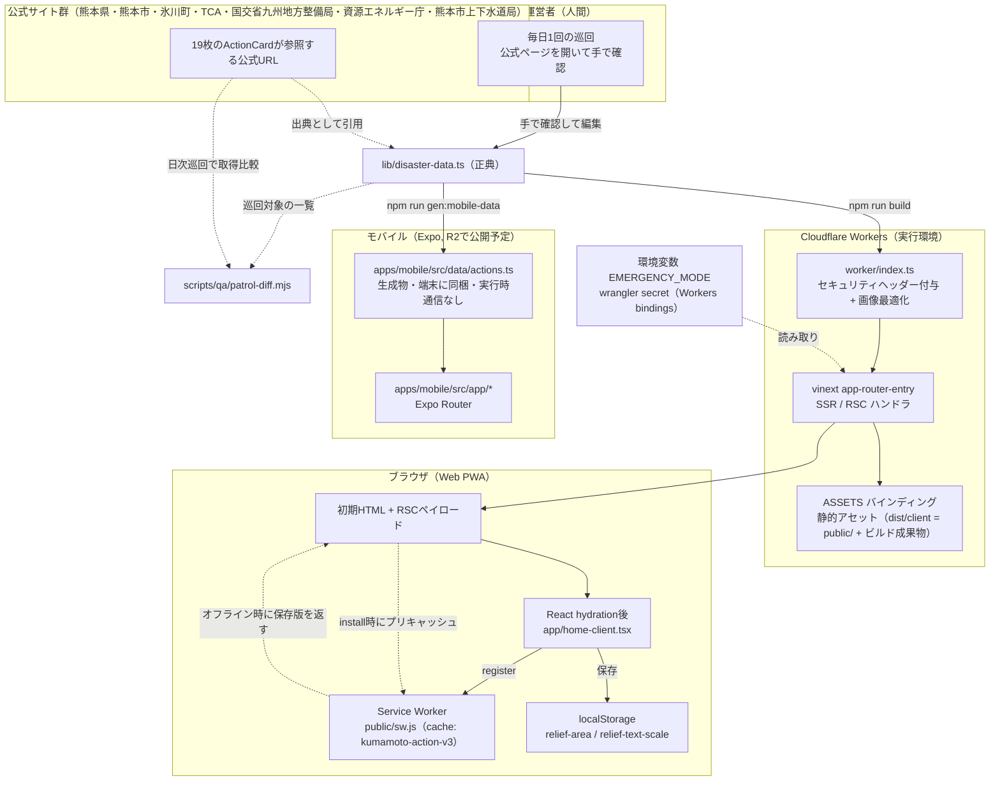
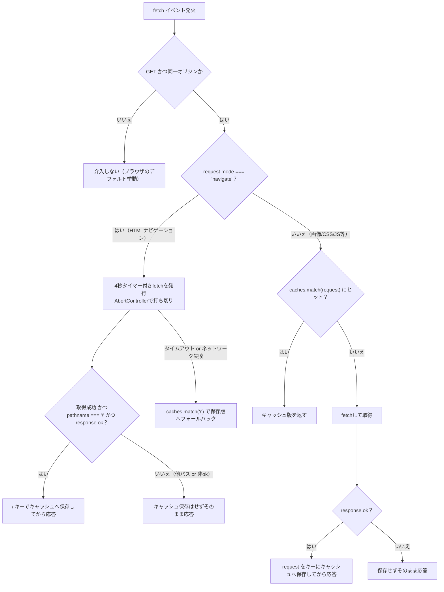
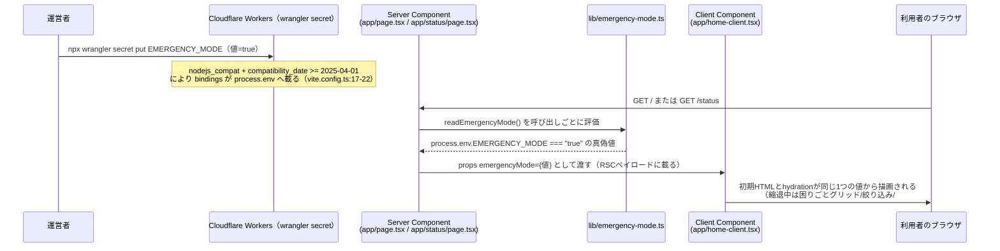
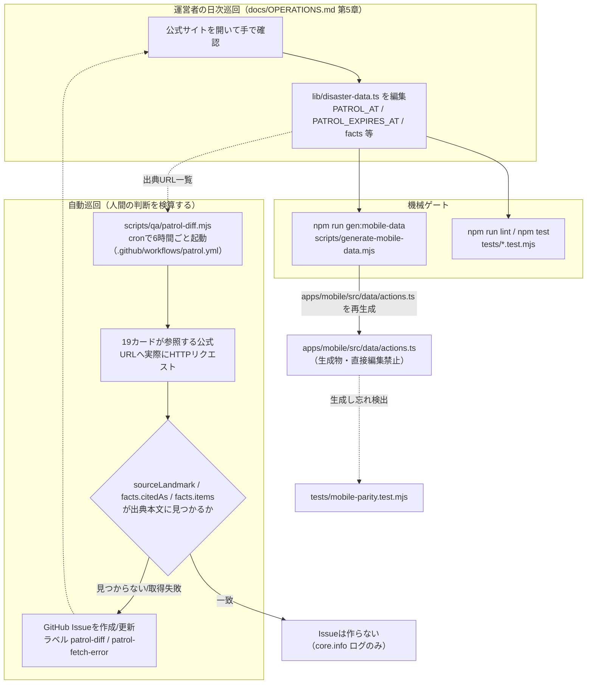
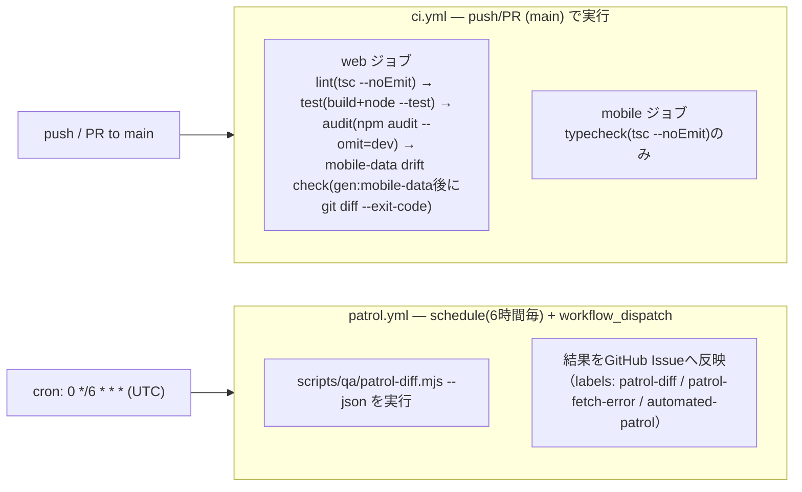

# アーキテクチャ — くまもと いまどうするナビ

最終更新: 2026-08-02 / 出典: 実コード調査（`worker/index.ts`, `public/sw.js`, `lib/emergency-mode.ts`, `app/page.tsx`, `app/status/page.tsx`, `app/home-client.tsx`, `scripts/generate-mobile-data.mjs`, `scripts/qa/patrol-diff.mjs`, `.github/workflows/ci.yml`, `.github/workflows/patrol.yml`, `vite.config.ts`）

## 1. 全体構成

**要点**

- Cloudflare Workers上で `worker/index.ts` が受け口になり、`/_vinext/image` は画像最適化ハンドラへ、それ以外は vinext の `app-router-entry` ハンドラ（SSR/RSC）へ委譲する。どちらの応答にもセキュリティヘッダーを付け直してから返す（`worker/index.ts:94-112`）。
- 実行時に外部（公式サイト）へ取りに行く処理はアプリ本体のコードには無い。情報は運営者が巡回時に手で `lib/disaster-data.ts` へ書く（`docs/DESIGN.md:111-112` の記述をコードでも確認: `lib/disaster-data.ts` にはfetch呼び出しが無い）。`scripts/qa/patrol-diff.mjs` だけが公式URLへ実際にHTTPリクエストする（後述「データ更新フロー」）。
- ネイティブ（Expo）は `apps/mobile/src/data/actions.ts` を起動時にアプリへ同梱したデータとして読むだけで、実行時通信はゼロ（`README.md`「これは何か」）。EMERGENCY_MODE の停止経路もネイティブには届かない（`docs/RELEASE_AUDIT.md`「停止の到達範囲」, `docs/DESIGN.md:173-175`）。
- インフラとして持たないもの: KV / D1 / R2 / Durable Objects / キュー / **Workers の cron trigger** / DB / 認証基盤 / 外部APIクライアント / アクセス解析SaaS（`docs/DESIGN.md:384-392`。根拠は本書 `data-model.md` の「データベースは無い」章で裏取り）。後述する巡回パトロールの定期実行は GitHub Actions の `schedule` であり、公開アプリ（Workers）側の定期実行ではない。

## 2. リクエスト処理フロー

### 2-1. Service Worker（`public/sw.js`）のナビゲーション／非ナビゲーション経路

sw.jsはv3（`CACHE = "kumamoto-action-v3"`, `public/sw.js:1`）。前バージョンとの主な差分は、`/` キーの保存条件を厳格化したこと（`pathname === "/" かつ response.ok` の両方を満たす時だけ保存）と、ナビゲーションfetchに4秒のタイムアウトを持たせたこと（`public/sw.js:3, 24-39`）。

この設計により、`/status`（緊急停止の確認ページ）への遷移が `/` の保存内容を汚染しない（`pathname === "/"` チェックが無いと、`/status` の応答が誤って `/` キーへ保存されてしまう）。この性質は `tests/sw-cache.test.mjs` の「`/status` へのナビゲーション後も `/` キーの内容はトップページのまま」テストで固定されている（`tests/sw-cache.test.mjs:113-129`）。

### 2-2. EMERGENCY_MODE（緊急縮退）の判定経路

`readEmergencyMode()` は関数の中でしか `process.env` を読まない実装で、モジュールのトップレベルで値を確定させない（`vinext start` はNode常駐のため一度しか評価されず、切り替えが効かなくなるのを防ぐ。`lib/emergency-mode.ts:14-21`）。クライアントコンポーネントからは呼ばない（クライアントバンドルでは `process.env` が空オブジェクトに置換され常にfalseになる）。この3条件は `tests/emergency-mode.test.mjs` がソースコードの形そのものを検査して固定している（`tests/emergency-mode.test.mjs:104-125`）。

縮退中に消える要素・残る要素は `app/home-client.tsx:169-525` の5箇所の条件付きレンダリング（`{!emergencyMode && ...}`。169 / 248 / 259 / 274 / 294行）で実装されており、詳細は `screens.md` を参照。

## 3. データ更新フロー

**正典は1つ。** `lib/disaster-data.ts` だけが情報の原本で、ネイティブ用 `apps/mobile/src/data/actions.ts` は `npm run gen:mobile-data`（実体: `scripts/generate-mobile-data.mjs`）の生成物（`README.md`「開発の勘所」）。生成スクリプトはソーステキストを `export const municipalities` と `export const siteCheckedAt` の2つのマーカー文字列で切り出して複製し、`actionCards` 本体は `JSON.stringify` で埋め込む（`scripts/generate-mobile-data.mjs:18-19, 46-63`）。マーカー文字列が消えたり並びが変わると生成が例外で止まる（`scripts/generate-mobile-data.mjs:23-29`）。

**巡回パトロールはデータを自動更新しない。** `scripts/qa/patrol-diff.mjs` は `lib/disaster-data.ts` の `sourceLandmark` / `facts[].citedAs` / `facts[].items` が出典ページの本文に実在するかをテキスト正規化のうえで照合するだけで（`scripts/qa/patrol-diff.mjs:28-38, 116-142`）、差分が見つかっても `lib/disaster-data.ts` を書き換えず、GitHub Issueで人間に通知するだけ（`.github/workflows/patrol.yml:5-7` のコメントで明示）。

## 4. CI/CD（`.github/workflows` の2本）

| workflow | トリガー | 役割 | 副作用 |
|---|---|---|---|
| `ci.yml` | `push`（main）/ `pull_request`（main）/ `workflow_dispatch` | webジョブ: lint・ビルド込みテスト・依存監査・正典→生成物のドリフト検知。mobileジョブ: 型検査のみ（`.github/workflows/ci.yml:1-78`） | リポジトリへの書き込みなし（`permissions: contents: read`、`.github/workflows/ci.yml:14-15`） |
| `patrol.yml` | `schedule`（6時間毎）/ `workflow_dispatch` | 出典サイトへ実際にアクセスし、カード内容との差分・取得失敗を検知してGitHub Issueで通知（`.github/workflows/patrol.yml:1-23`） | `issues: write`。Issueの作成・コメントのみで、`lib/disaster-data.ts` 等のデータやコードへの自動commitは一切行わない（コード先頭コメントとworkflow本体の両方で明示。`.github/workflows/patrol.yml:5-7`） |

`ci.yml` はNode 24（npm 11系）を使う。開発機と同じnpmメジャーでlockファイルを生成しているため、Node 22系のnpm 10では `npm ci` が依存欠落として失敗する実測があったための固定（`.github/workflows/ci.yml:32-38`）。`patrol.yml` も同じ理由でNode 24を使う（`.github/workflows/patrol.yml:35-39`）。

## 持っていないインフラ（裏取り済み）

`KV / D1 / R2 / Durable Objects / キュー / cron trigger / データベース / 認証基盤・セッション / 外部APIクライアント / アクセス解析・広告・エラー収集SaaS` は無い。根拠は `data-model.md` の「データベースは無い」章を参照（`db/` `drizzle/` が空であることをgit履歴・grepで直接確認済み）。
