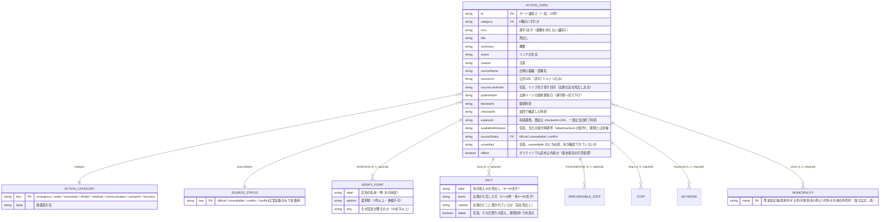

# データモデル — くまもと いまどうするナビ

最終更新: 2026-08-02 / 出典: 実コード調査（`lib/disaster-data.ts`, `scripts/generate-mobile-data.mjs`, `apps/mobile/src/data/actions.ts`, `db/`, `drizzle/`, `.openai/hosting.json`, `vite.config.ts`, `build/sites-vite-plugin.ts`, `tests/data-contract.test.mjs`, `tests/mobile-parity.test.mjs`, `git ls-files` / `git log` による裏取り）

## RDBは存在しない（裏取り済み）

**永続化層を持たない。** テーブルもリレーションも外部キーも存在しない。以下は本ドキュメントの独自調査による確認結果。

| 確認対象 | 方法 | 結果 |
|---|---|---|
| `db/` | `find db -mindepth 1` | 出力なし＝完全に空 |
| `drizzle/` | `find drizzle -mindepth 1` | `drizzle/meta` のみ存在し、その中も空 |
| `db/` `drizzle/` `examples/d1/` のgit追跡状況 | `git ls-files db/ drizzle/ examples/` | 0件（追跡ファイルなし） |
| `db/` `drizzle/` `examples/d1/` のコミット履歴 | `git log --all -- db/ drizzle/ examples/d1` | 0件（一度もコミットされたことがない＝空ディレクトリのまま） |
| アプリコードからの参照 | `grep -rn "drizzle\|D1Database" --include="*.ts" --include="*.tsx" .`（node_modules/.wrangler除外） | `vite.config.ts` と `build/sites-vite-plugin.ts` のみヒット。`app/` `lib/` `worker/` からの参照は0件 |

**これらは vinext-starter テンプレートの汎用デプロイ足場（未使用）である。** `.openai/hosting.json` は `{"d1": null, "r2": null}`（`.openai/hosting.json`）。`vite.config.ts:9-33` はこの値を読み、`d1` / `r2` が `null` のときは `d1_databases` / `r2_buckets` を空配列にする条件分岐になっている。`build/sites-vite-plugin.ts:27-43` はビルド後に `drizzle/` ディレクトリが存在すれば `dist/.openai/drizzle` へコピーするだけの処理で、`drizzle/` が空の現状ではコピー対象も存在しない。`examples/d1/app/api/notes/` `examples/d1/db/` も同様に空で、gitに一度も追跡されたことがない。

以上より、`db/` `drizzle/` `examples/d1/` は**アプリのデータ永続化には一切使われていない、テンプレート由来の未使用スキャフォールド**と結論づけられる（`grep`・`git log`・設定ファイルの3方向から確認済み）。

## 実体はTypeScriptのソースコード配列

データの実体は `lib/disaster-data.ts` に**ソースコードとして直接書かれた配列**（`actionCards: ActionCard[]`, `lib/disaster-data.ts:153`）で、ビルド時にバンドルへ埋め込まれる。実行時に読み書きする永続ストアは無い。

## ER図（論理データモデル。DBスキーマではない）



（`IRREVERSIBLE_STEP` / `STEP` / `KEYWORD` は文字列配列なので独立エンティティとしては図から省略し、上のリレーション行にのみ表記。フィールド定義は `lib/disaster-data.ts:14-94` の `ActionCard` 型そのもの）

## 現在のデータ量（2026-08-02時点、`lib/disaster-data.ts` から集計）

全19カード。カテゴリ内訳:

| category | 件数 | カードID |
|---|---|---|
| `emergency` | 2 | `official-kumamoto`, `kumamoto-city-hub` |
| `water` | 2 | `water-station`, `water` |
| `essentials` | 8 | `food-and-supplies`, `food-hikawa`, `fuel`, `toilet`, `toilet-container`, `infant-care`, `bath-kumamoto`, `elder-care` |
| `shelter` | 2 | `shelter`, `shelter-hikawa` |
| `medical` | 1 | `medical` |
| `communication` | 1 | `communication` |
| `transport` | 1 | `roads` |
| `recovery` | 2 | `evidence`, `support-systems` |

`sourceStatus: "unavailable"` のカードは3件（`food-and-supplies`, `toilet`, `infant-care`）。`conflict` は型に定義済みだが現在使っているカードは無い（`docs/DESIGN.md:573` の記述をコード側でも再確認済み）。

**この2つの数え方について。** カードは `sourceStatus` を直接書かず、`patrolled()` ヘルパー（`lib/disaster-data.ts:145-151`。第2引数の既定は `"official"`）経由で設定する。そのため `grep 'sourceStatus: "unavailable"'` のような値リテラル検索は、実在する3件に対しても0件を返してしまい根拠にならない。実際に使った根拠は次の2つ。

| 確認対象 | 方法 | 結果 |
|---|---|---|
| `unavailable` の件数 | `patrolled(..., "unavailable")` の呼び出し箇所（`lib/disaster-data.ts:383`, `552`, `642`）と、`unavailable` のとき必須になる `unverified` フィールドの出現箇所（`384`, `553`, `643`）を突き合わせ | 3件・両者一致 |
| `conflict` の使用 | `grep -n conflict lib/disaster-data.ts` | ヒットは型定義 `lib/disaster-data.ts:12` の1行のみ（＝カードでの使用0件） |

## 正典 → ネイティブ生成の関係

```text
入力: lib/disaster-data.ts（正典）
出力: apps/mobile/src/data/actions.ts（生成物・直接編集禁止）
実行: npm run gen:mobile-data
```

`scripts/generate-mobile-data.mjs` は正典のソーステキストを2つのマーカー文字列で3分割する（`scripts/generate-mobile-data.mjs:18-33`）。

| マーカー | 用途 |
|---|---|
| `export const municipalities`（の直前まで） | 型定義ブロック（`ActionCategory` / `SourceStatus` / `ActionCard` 型）としてそのまま複製 |
| `export const siteCheckedAt`（から末尾まで） | 時刻ヘルパー（`formatTimestamp` / `formatRelativeTime` / `isExpired` / `visibleFacts` 等）としてそのまま複製 |

中間の `municipalities` / `categoryLabels` / `actionCards` はJavaScriptの値として再構築され、`actionCards` は `JSON.stringify(actionCards, null, 2)` でそのまま埋め込まれる（`scripts/generate-mobile-data.mjs:36-63`）。マーカー文字列を消す・並びを変えると生成処理が例外を投げて止まる（`scripts/generate-mobile-data.mjs:23-29`）。`ActionCard` にフィールドを追加すれば自動的にネイティブへ配られる。

`tests/mobile-parity.test.mjs` が「生成物が正典と `deepEqual` で一致すること」と「再生成し忘れが無いこと」を機械的に固定している。`visibleFacts()`（期限切れの `dated: true` な `facts` を非表示にする関数）もWeb・ネイティブ双方がこの共通関数経由でしか描画しないことを同テストが確認する（`docs/DESIGN.md:590` の記述と実装 `lib/disaster-data.ts:1087-1090` を照合）。

## 制約（テストで機械的に守っているもの。`tests/data-contract.test.mjs`）

| 対象 | 制約 |
|---|---|
| `sourceUrl` | 許可7ドメインのみ（`api.md` の外部参照先テーブル参照） |
| 時刻4種（`publishedAt`/`fetchedAt`/`checkedAt`/`expiresAt`） | すべて解釈可能な日時文字列。`publishedAt <= fetchedAt`・`checkedAt <= expiresAt` |
| `sourceStatus` | `official` または `unavailable`（`conflict` は現状未使用） |
| `unverified` | `unavailable` なら20文字以上かつ「確認できません（でした）」を含む必須文字列。`official` なら未定義であること |
| `steps` | 2〜5件・各5〜60文字・断定表現（「必ず開」「在庫あり」「営業中です」等）を含まない |
| `verifyPoints` | `options` 2件以上・重複なし／`why` 20文字以上 |
| `facts` | `label` 4〜40文字・カード内で重複なし／`items` 1〜15件・各4〜60文字・重複なし・断定表現なし／`citedAs` 4文字以上 |
| `facts`（`unavailable` カード） | `label` に「窓口／問い合わせ／問合せ／相談／連絡先」を含むもののみ（未確認カードが答えを持つように見せない） |
| `facts`（当日限り2カード: `water-station` / `food-hikawa`） | `dated: true` の `facts` と `sourceLandmark` を必ず持つ |
| `facts` の失効 | `dated: true` は `expiresAt` ちょうどで非表示、`dated` 無しは残存 |
| `sourceLandmark` | 4〜60文字・カギ括弧は含めない |
| `water` カード | 飲料水／生活用水の区別を持つ `verifyPoints` を必須で持つ |
| `irreversibleOrder` | 2〜5件・各5〜60文字 |
| 検索到達性 | 「こども」「くすり」「みず」等18語から意図したカードへ到達すること |
| カテゴリ網羅 | R1必須8カテゴリすべてを備える |
| 失効境界 | `now.getTime() >= expiresAt` で失効側へ倒れる（`isExpired()`, `lib/disaster-data.ts:1075-1077`） |
| `availableWindows` | 各枠 `start < end`／時刻順で重ならない／全枠が `checkedAt` と同じ日（JST）／**最終枠の `end` は `expiresAt` と一致**／持つカードは `caution` に「出発前」を含む |
| 受付時間の境界 | `start <= now < end` を「開いている」とする（`serviceWindow()`）。開始は含み終了は含まない＝閉まっている方へ倒す |

### 期限と受付時間は別の軸

`expiresAt` は「この情報を信じてよいか」、`availableWindows` は「行けば受け取れるか」を表す。片方だけでは無駄足を防げない。氷川町の配布は9:00〜11:00と15:00〜17:00の2回で `expiresAt` は17:00のため、`availableWindows` が無かった間は**11:00〜15:00の4時間、誰もいないのにカードが「有効」**だった。

`expiresAt` と `availableWindows` は毎日の巡回で両方を当日分へ更新する。片方だけ更新した状態は上の制約（最終枠の `end` ＝ `expiresAt`、全枠が `checkedAt` と同日）で `npm test` が落ちる。

判定と文言はどちらも正典（`serviceWindow()` / `serviceWindowNotice()`）に置き、Web とネイティブが同じものを使う。文言は断定の方向が非対称で、受付時間外は言い切り、受付時間内は「告知では」を付けて中止・早期終了の可能性を必ず添える。

### 地域ごとの集計（`areaCoverage()`）

`ActionCard` に**フィールドを1つも足していない**。既存の `areas` / `expiresAt` / `sourceStatus` から数え直すだけの導出関数で、緯度経度は持たない（決定は `docs/adr/0002-area-map-uses-municipality-tiles-not-pins.md`）。

| 返す値 | 定義 |
|---|---|
| `localCount` | `areas` にその市町村を**名指ししている**カードの数。県全域カードは含めない |
| `expiredCount` | `localCount` のうち `isExpired()` が真の数 |
| `unverifiedCount` | `localCount` のうち `sourceStatus === "unavailable"` の数 |
| `wideCount` | `areas` に「熊本県全域」を含むカードの数。県全域タイル自身では `0`（自分の `localCount` と同じものなので二重計上しない） |
| `tone` | `localCount === 0` → `none` ／ 全件失効 → `expired` ／ 期限切れか未確認を含む → `partial` ／ その他 → `covered` |

**絞り込みとは数え方が違う。** 絞り込み（`app/home-client.tsx` の `filtered`）は「県全域カードはどの市町村でも出す」という緩い規則を使うが、その規則で数えると全タイルに県全域の案内が乗り、固有の案内が1枚も無い地域まで手厚く見える。この関数の目的は、欠けている地域を欠けたまま見せることにある。

関数は `lib/disaster-data.ts` の**末尾**に置いている。`scripts/generate-mobile-data.mjs` の tail 切り出しがマーカーからEOFまでを取るのでネイティブ側へ複製され、かつ既存の行番号参照を1つもずらさない。

## 端末に保存されるもの

サーバー側に利用者データは無い。端末側は次のみ（`app/home-client.tsx:51-63, 158-166`）。

| 保存先 | キー | 内容 | 個人を識別するか |
|---|---|---|---|
| `localStorage`（Web） | `relief-area` | 選んだ市町村名 | しない |
| `localStorage`（Web） | `relief-text-scale` | 文字サイズ（`standard`/`large`/`xlarge`） | しない |
| `localStorage`（Web、旧キー） | `relief-large-text` | 読み取り時に `relief-text-scale` へ移行（`app/home-client.tsx:52-63`） | しない |
| Cache Storage（Web） | `kumamoto-action-v3` | HTMLと静的アセット（`public/sw.js:1`） | しない |
| `AsyncStorage`（モバイル） | `AREA_KEY = "relief-area"`（`apps/mobile/src/theme.ts:104`） | 選んだ市町村名（`apps/mobile/src/app/index.tsx:66-71, 135-138`） | しない |
