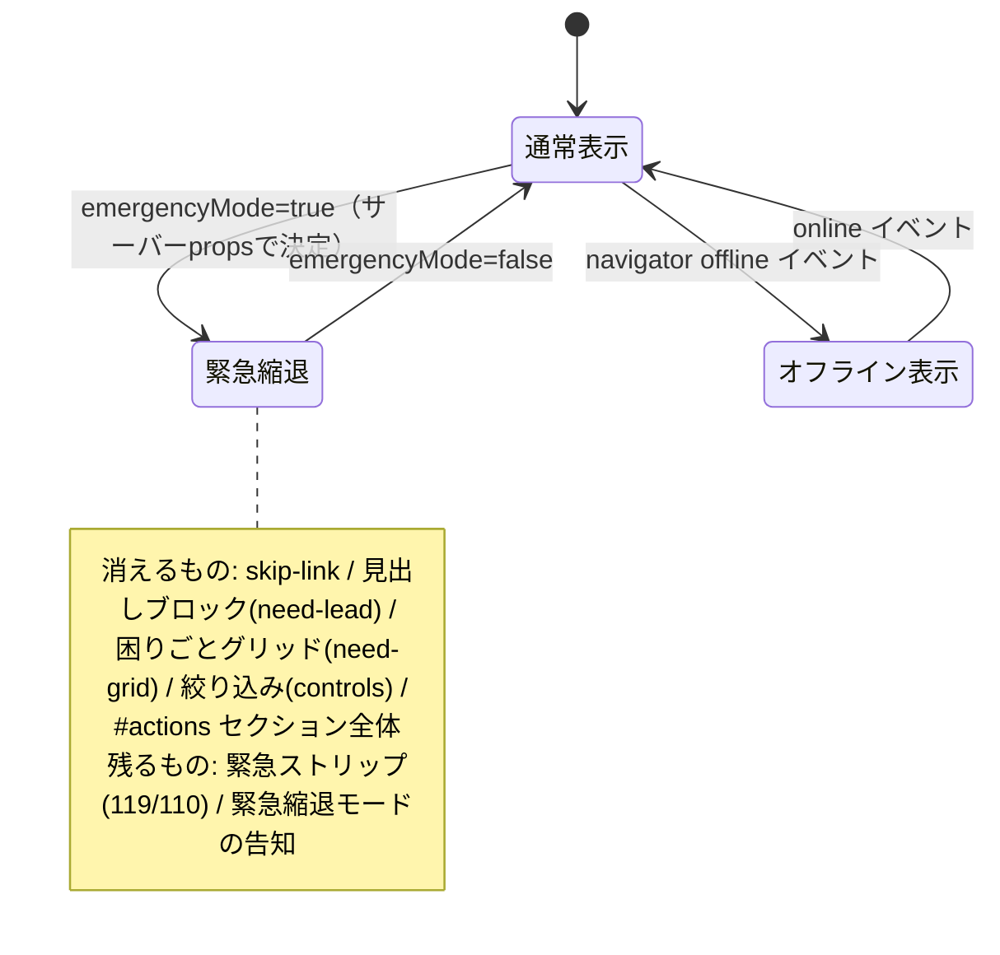
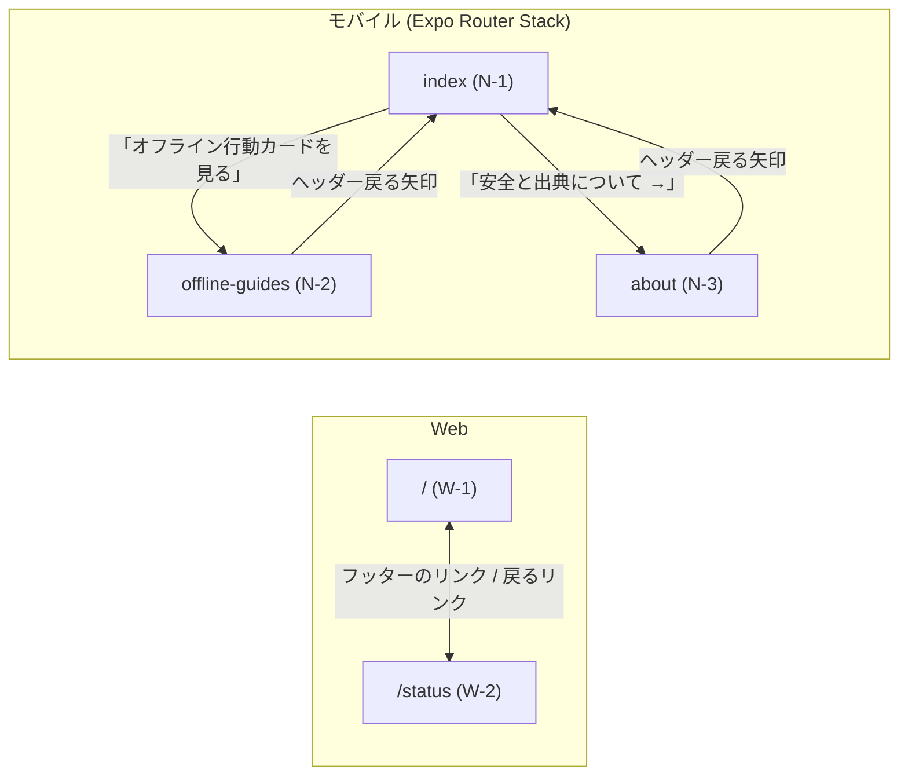

# 画面設計書 — くまもと いまどうするナビ

最終更新: 2026-08-02 / 出典: 実コード調査（`app/page.tsx`, `app/status/page.tsx`, `app/home-client.tsx`, `apps/mobile/src/app/*`, `tests/emergency-mode.test.mjs`）

## 画面一覧

| # | 経路 | プラットフォーム | 種別 | 目的 |
|---|---|---|---|---|
| W-1 | `/` | Web | Client Component（`emergencyMode` をpropsで受領） | 困りごとから公式情報へ案内する（`app/page.tsx`, `app/home-client.tsx`） |
| W-2 | `/status` | Web | Server Component | 運用状態（緊急縮退の有無）と安全境界の開示（`app/status/page.tsx`） |
| N-1 | `index`（初期ルート） | モバイル（Expo Router, ヘッダー非表示） | W-1のネイティブ版 | `apps/mobile/src/app/index.tsx` |
| N-2 | `offline-guides` | モバイル（Expo Router, タイトル「オフライン行動カード」） | 通信不可でも読める一般手順 | `apps/mobile/src/app/offline-guides.tsx` |
| N-3 | `about` | モバイル（Expo Router, タイトル「安全と出典について」） | 安全と出典についての説明 | `apps/mobile/src/app/about.tsx` |

モバイルのスクリーン構成（Stack、`headerStyle`/`headerTintColor`等の共通設定）は `apps/mobile/src/app/_layout.tsx:14-24` で定義される。

## W-1 `/` 案内画面（Web）

### ワイヤーフレーム（通常表示）

```text
┌───────────────────────────────────────────┐
│ 緊急ストリップ    119 消防・救急 ▸  110 警察 ▸ │ ← 常に最上部。縮退中も残る
├───────────────────────────────────────────┤
│ ブランド「くまもと いまどうするナビ」  文字 標準/大/特大 │
├───────────────────────────────────────────┤
│（縮退中はここに「緊急縮退モード」の告知が入る）        │
│（オフライン時は「オフラインです」の通知が入る）        │
├───────────────────────────────────────────┤
│ ● 接続確認 約N分前（鮮度バー。期限切れがあれば警告文）  │
├───────────────────────────────────────────┤
│ 「令和8年熊本地震・生活支援」  ← 縮退中は消える     │
│ 「いま困っていることは？」    （need-lead ごと）   │
├───────────────────────────────────────────┤
│ 困りごとグリッド（8種 × 件数）                  │
│  緊急・安全/水・給水/食料・生活/避難所/薬・医療/     │
│  連絡・充電/移動・道路/片付け・制度               │
├───────────────────────────────────────────┤
│ 地域から選ぶ（area-map）                        │
│  位置関係は実際の地理と異なります。               │
│  件数は公式ページで確認できた案内の数です。…       │
│  ┌─────────────────────────────────────┐  │
│  │ 熊本県全域        案内 6件            │  │
│  ├──────────────┬──────────────────────┤  │
│  │ 熊本市 案内10件 │ 宇土市                │  ← 北
│  │  未確認3件      │ 名指しの案内なし      │  │
│  ├──────────────┼──────────────────────┤  │
│  │ 宇城市 案内1件  │ 氷川町 案内3件        │  │
│  ├──────────────┼──────────────────────┤  │
│  │ 八代市 案内1件  │ その他 案内1件        │  ← 南
│  └──────────────┴──────────────────────┘  │
│  このほかに、どの地域でも使える県全域の案内がN件… │
├───────────────────────────────────────────┤
│ 絞り込み  [キーワード検索]                        │
├───────────────────────────────────────────┤
│ #actions 「○○で確認すること」 N件                │
│  カテゴリナビ（横スクロール, 全9種）              │
│  ┌─────────────────────────────────────┐  │
│  │ アクションカード（icon/meta/title/…）    │  │
│  │ …19カード中、条件に一致した分だけ表示     │  │
│  └─────────────────────────────────────┘  │
├───────────────────────────────────────────┤
│ 「このアプリがしないこと」                        │
├───────────────────────────────────────────┤
│ フッター（免責文 / 運用ステータスへのリンク）        │
└───────────────────────────────────────────┘
```

### 地域から選ぶ図（`area-map`）

市町村の絞り込みを、面（地域）で並べた図にしたもの。従来の `<select>` を置き換えている（操作子は純増しない）。決定と却下案は `docs/adr/0002-area-map-uses-municipality-tiles-not-pins.md`。

**点（ピン）を置かない。** 施設名から緯度経度を引くことは出典に無い情報を推測で作ることであり、地図上のピンは「そこが今使える」と読ませて、このアプリが引き受けないと決めた稼働状況の判定を表示形式だけで肩代わりしてしまう。面なら既に持っている `areas` だけで描ける。地図ライブラリ・タイル画像・座標のいずれも持たない。

| 要素 | 出す条件 | 意図 |
|---|---|---|
| 「位置関係は実際の地理と異なります。」 | 常時 | 模式配置であることを言う。地理的な近さを読み取らせない |
| 「件数は公式ページで確認できた案内の数です。現地が今使えるかどうかではありません。」 | 常時 | 件数だけを並べると「多い＝安全」と読まれる。カバレッジと稼働状況を分ける |
| 市町村名 | 全7件を常時 | 1件でも図から欠けると、その地域の利用者は自分の欄が無いことに気づけない |
| 「案内 N件」 | `localCount > 0` | その市町村を**名指しした**カードの数。県全域カードは含めない |
| 「この地域を名指しした案内はありません」 | `localCount === 0` | 0件を0件のまま出す。これがこの図の本体 |
| 「期限切れ N件 / 未確認 N件」 | どちらかが1件以上 | 欠け方を色ではなく文字で出す（印刷と色覚差で消えないため） |
| 「このほかに、どの地域でも使える熊本県全域の案内がN件あります。」 | 期限内の県全域カードが1件以上 | 0件を「この地域には何も無い」と読ませない。図の下に1度だけ |
| 「…はいまはすべて期限切れです。」 | 期限内の県全域カードが0件 | 全部期限切れなのに件数を出すのは鮮度の捏造にあたる |

調子（`tone`）は**欠けている度合いだけ**を表す。良い状態に色を付けない。期限内であることは「公式ページの更新を確認できた」という意味でしかなく、現地が使えるという意味ではないため、成功を示す緑を置かない。

| tone | 条件 | 見た目 |
|---|---|---|
| `covered` | 期限切れ・未確認なし | 既定（色を足さない） |
| `partial` | 期限切れか未確認を含む | 左辺 黄（`--warn-border`） |
| `expired` | 全件が期限切れ | 左辺 赤（`--red`）＋背景 `--chip-bg` |
| `none` | `localCount === 0` | 破線の枠・影なし |

集計は `lib/disaster-data.ts` の `areaCoverage()` が単独で持ち、Web・ネイティブとも必ずこの関数を経由する（`tests/mobile-parity.test.mjs` が固定）。画面側で数え直すと、同じアプリの利用者が端末によって違う件数を見ることになる。

### アクションカードの構成（上から順。`app/home-client.tsx:397-587` の `<article className="action-card">`）

| 要素 | 出す条件 | 意図 |
|---|---|---|
| アイコン（漢字1文字） | 常時 | 画像を持たずに識別する |
| メタ（カテゴリ / オフライン保存 / **公式情報** or **未確認** / 期限切れ） | 常時 | `sourceStatus === "unavailable"` に「公式情報」と付けない |
| 見出し | 常時 | |
| 概要 **または** 期限切れメッセージ | 排他（`isExpired()`で分岐） | 期限切れ時は場所・時間を出さない |
| **受付時間の案内**（`serviceWindowNotice()`） | 期限内 かつ `availableWindows` あり（当日限り2枚） | 期限内でも現地が閉まっている時間を出す。期限切れ表示とは排他 |
| **公式の案内を確認できていません** | `sourceStatus === "unavailable"` | 手順より**前**に出す |
| `facts`（出典から写した答え） | `visibleFacts()` が返す件数 > 0 | 5件超は `<details>` で開閉（`FACT_INLINE_LIMIT = 4`, `lib/disaster-data.ts:1050`） |
| 出典・有効期限のサマリ行 | 常時 | |
| 手順と注意（`<details>` で既定は畳む） | 常時 | JS前でも開ける。「まずやること」番号付き手順 |
| **公式ページで必ず確認する: ラベル**（`verifyPoints`） | `verifyPoints` あり | 期限切れでも隠さない |
| **順番を間違えると取り返しがつきません**（`irreversibleOrder`） | `irreversibleOrder` あり | 同上 |
| 注意 | 常時 | |
| 出典と時刻の詳細（さらに畳む） | 常時 | 出典・案内更新・取得・接続確認・有効期限 |
| 公式サイトを開くリンク | 常時 | オフライン時は無効化 |
| `sourceLandmark`（探す先の名指し） | `sourceLandmark` あり | 深いURLが無い出典向け |

#### 受付時間の案内の出し分け

期限（この情報を信じてよいか）とは別に、受付時間（行けば受け取れるか）を出す。**断定してよい方向が非対称**であることが要点で、色の強さも「言い切れるかどうか」に合わせる。

| 状態 | 見出し | 色 | なぜその強さか |
|---|---|---|---|
| `before` | 本日の受付はまだ始まっていません | 黄（`--warn-*`） | 待てば開く。止める必要はない |
| `open` | **告知では**受付時間内です | 控えめな緑（`--calm-*`） | 中止・早期終了がありうるので言い切れない。緑を成功色にすると「行けば必ずもらえる」と読ませる |
| `between` | いまは受付時間外です | 赤（`--red`/`--red-soft`） | 告知の時刻からの帰結なので言い切れる。無駄足を止める表示なので最も強くする |
| `closed` | 本日の受付は終了しました | 同上 | 通常は期限切れ表示が先に立つ（最終枠の終了＝`expiresAt`） |

`open` では終了までの残り（`formatRemaining()`、切り捨て）も出す。「17:00まで」だけでは移動時間を足して間に合わないことに気づけないため。どの状態でも「出発前に当日の掲載を確認してください」を必ず添える。

### 状態と分岐（`app/home-client.tsx`）



| 要素 | 通常表示 | 緊急縮退中 | テストで固定 |
|---|---|---|---|
| `skip-link`（スキップリンク） | あり | 消える（行き先の`#actions`が無いため） | あり |
| `need-lead`（「令和8年熊本地震・生活支援」「いま困っていることは？」の見出しブロック） | あり | 消える | なし |
| `need-grid`（困りごとグリッド） | あり | 消える | あり |
| `area-map`（地域から選ぶ図） | あり | 消える（止めているのに「N件ある」と読ませない） | あり |
| `controls`（キーワード絞り込み） | あり | 消える | あり |
| `action-section`（`#actions`本体・カード一覧） | あり | 消える | あり |
| `emergency-strip`（119・110） | あり | **残る** | あり |
| `maintenance-notice`（緊急縮退モードの告知文） | 無し | **表示される** | あり |

（縮退中に無反応の操作子を残さない設計。見出しブロック・困りごとグリッド・地域から選ぶ図・絞り込み・スキップリンクは行き先の`#actions`ごと消えるため、`app/home-client.tsx:180-600` の6箇所の `{!emergencyMode && ...}`（180 / 259 / 270 / 295 / 357 / 369行）により描画自体を外している）

「テストで固定」列は `tests/emergency-mode.test.mjs:47-66` がHTML出力を直接検査している項目。`need-lead` だけは同テストの検査対象に入っていないため、現状はコードの条件分岐（`app/home-client.tsx:259-264`）のみが根拠になる。

### クライアント状態（`app/home-client.tsx:41-79`）

| state | 初期値 | 永続化 | 備考 |
|---|---|---|---|
| `municipality` | `熊本県全域` | `localStorage: relief-area` | |
| `category` | `all` | なし | |
| `query` | 空 | なし | |
| `textScale` | `standard` | `localStorage: relief-text-scale` | 旧 `relief-large-text` から移行 |
| `offline` | `false` | なし | `online`/`offline` イベント |
| `now` | 現在時刻 | なし | 60秒ごとに更新（失効表示の切り替え、`setInterval`） |

`localStorage` の読み出しは `useEffect` 内の `queueMicrotask` で行い、サーバーとクライアントの初期描画を一致させる（hydration不一致回避、`app/home-client.tsx:50-65`）。

## W-2 `/status` 運用ステータス（Web, Server Component）

### ワイヤーフレーム

```text
┌───────────────────────────────────┐
│ 運用ステータス                       │
│ くまもと いまどうするナビ              │
├───────────────────────────────────┤
│ [通常表示]  または  [緊急縮退中]（配色が変わる）│
│  説明文（現在の状態の意味）              │
├───────────────────────────────────┤
│ 安全上の状態                         │
│  ・利用者投稿・支援要請・寄付・決済：提供していません│
│  ・GPS・住所・氏名・健康情報：収集していません     │
│  ・期限切れ情報：現在不明として表示します        │
│  ・公式サイト障害：保存時刻を示し、最新とは表示しません│
├───────────────────────────────────┤
│ → 案内画面へ戻る                      │
└───────────────────────────────────┘
```

（`app/status/page.tsx:9-33` を直接反映。`readEmergencyMode()` をリクエストごとに読む。secretは読み出せないため、このページが現在の停止状態を確認できる唯一の経路）

## N-1 `index`（モバイル・ホーム画面）

W-1とほぼ同一の構成をExpo Router + React Nativeで再実装している（`apps/mobile/src/app/index.tsx`）。緊急ストリップ→ブランド→文字サイズ→鮮度バー→「いま困っていることは？」見出し→困りごとグリッド→市町村チップ→キーワード検索→カテゴリチップ→アクションカード一覧→オフライン行動カードへの導線パネル→安全パネル→フッター、の順（`apps/mobile/src/app/index.tsx:182-742`）。

**Web/モバイルのパリティ状況（現行コードで確認）**: `docs/DESIGN.md`（2026-07-31時点）は「`verifyPoints` / `irreversibleOrder` / `unverified` はネイティブへ生成物として配られているが、N-1の画面にはまだ描画していない」と記録しているが、**現在の `apps/mobile/src/app/index.tsx` はこの3つをすべて描画している**（`unverified`: 476-485行、`verifyPoints`: 597-609行、`irreversibleOrder`: 618-634行）。緊急停止フラグ（`EMERGENCY_MODE`）に相当する経路はモバイルには存在せず、`apps/mobile/src` 配下に該当する参照は無い（`docs/RELEASE_AUDIT.md`「停止の到達範囲」の「一切届かない」という記述と一致）。

モバイル独自の開閉状態として `expandedSources` / `expandedDetails` / `expandedFacts` を持つ（`apps/mobile/src/app/index.tsx:70-74`）。Webの `<details>` に相当する挙動をReact Nativeでは自前のstateで実装している。

## N-2 `offline-guides`（オフライン行動カード）

通信不可でも読める一般手順を4種類、静的に持つ（`apps/mobile/src/app/offline-guides.tsx:8-29`）。

```text
┌───────────────────────────────┐
│ 端末に保存済み                     │
│ 通信がなくても読める行動カード        │
│ 「一般的な手順です。…」               │
├───────────────────────────────┤
│ カード「通信できない」                │
│  手順1〜4（機内モード切替/JAPANローミング/│
│  公衆電話・171/手動選択の解除）        │
│  ⚠ 00000JAPANは暗号化されていません   │
├───────────────────────────────┤
│ カード「片付けを始める」               │
│ カード「トイレが使えない」             │
│ カード「薬が必要」                    │
└───────────────────────────────┘
```

## N-3 `about`（安全と出典について）

固定文言5項目（収集しない情報／状態の断定／AIの役割／外部サイト／緊急時）と、運営・訂正体制に関する注記を表示する静的画面（`apps/mobile/src/app/about.tsx:18-32`）。

## 画面遷移



WebとMobileは独立したアプリで、画面間の相互遷移（Web→Mobile等）は無い。各カードの「公式サイトを開く」ボタンは、いずれもアプリ外（公式サイト）へ新規タブ/ブラウザで遷移する（Web: `target="_blank"`、モバイル: `Linking.openURL()` を確認ダイアログ経由で呼ぶ。`apps/mobile/src/app/index.tsx:169-178`）。
